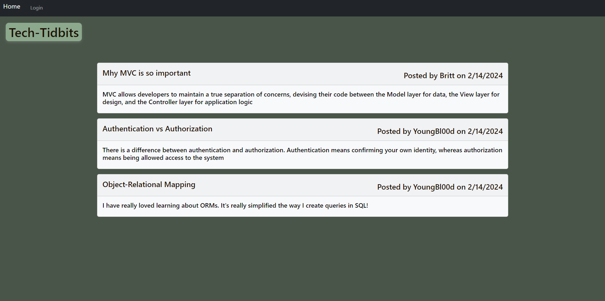
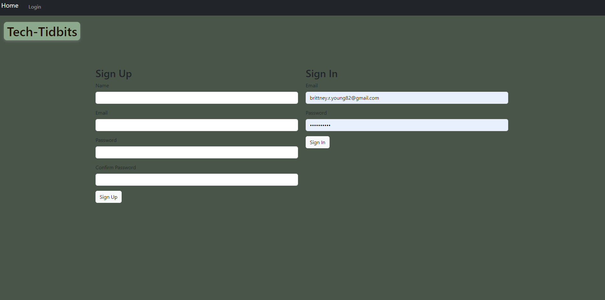
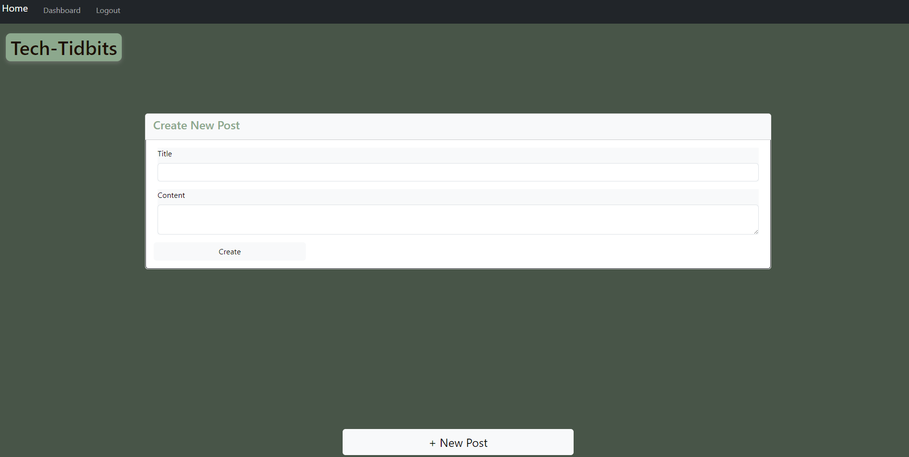
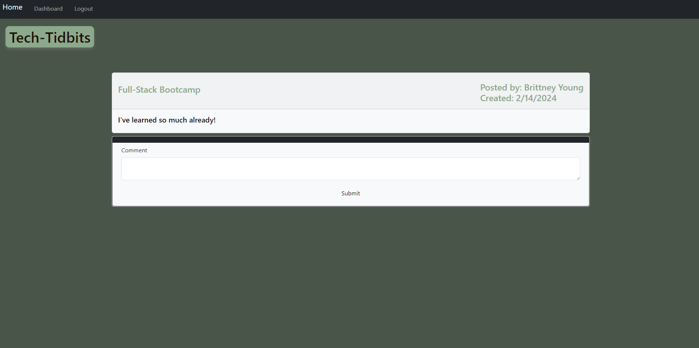

# tech-tidbits
Check out the deployed application [here](https://tech-tidbits-8bd44caf995d.herokuapp.com/)

A CMS-style blog site, where devs can publish and comment on blog posts. Deployed through Heroku using Handlebars.js as the templating language, Sequelize as the ORM, and the express-session npm package for authentication
```
AS A developer who writes about tech,
I WANT a CMS-style blog site,
SO THAT I can publish articles, blog posts, and my thoughts and opinions
```
## Table of Contents

- [Installation](#installation)
- [Usage](#usage)
- [Credits](#credits)
- [License](#license)

## Installation

 You’ll need to use the express-handlebarsLinks to an external site. package to use Handlebars.js for your Views, use the MySQL2Links to an external site. and SequelizeLinks to an external site. packages to connect to a MySQL database for your Models, and create an Express.js API for your Controllers.

You’ll also need the dotenv package links to an external site. to use environment variables, the bcrypt packageLinks to an external site. to hash passwords, and the express-sessionLinks to an external site. and connect-session-sequelizeLinks to an external site. packages to add authentication

## Usage

he express-sessionLinks to an external site. package stores the session data on the client in a cookie. When you are idle on the site for more than a set time, the cookie will expire and you will be required to log in again to start a new session. This is the default behavior and you do not have to do anything to your application other than implement the npm package.

Homepage
  

Login


Add Post


Comment


## Credits

List your collaborators, if any, with links to their GitHub profiles.

If you used any third-party assets that require attribution, list the creators with links to their primary web presence in this section.

If you followed tutorials, include links to those here as well.

## License

The last section of a high-quality README file is the license. This lets other developers know what they can and cannot do with your project. If you need help choosing a license, refer to [https://choosealicense.com/](https://choosealicense.com/).

---

🏆 The previous sections are the bare minimum, and your project will ultimately determine the content of this document. You might also want to consider adding the following sections.

## Badges


Badges aren't necessary, per se, but they demonstrate street cred. Badges let other developers know that you know what you're doing. Check out the badges hosted by [shields.io](https://shields.io/). You may not understand what they all represent now, but you will in time.
